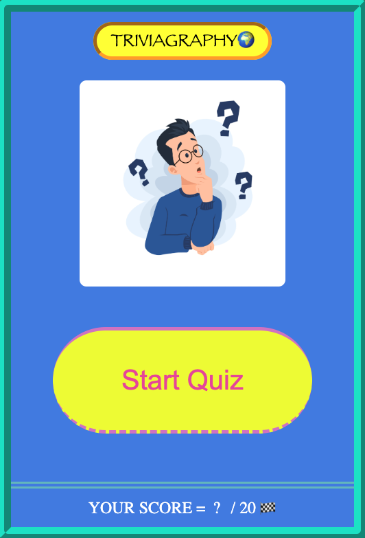

# TRIVIAGRAPHY

Welcome to TRIVIAGRAPHY🌍 - the game where you can put your geography skills to the test!
 - The rules of the game are simple! Just pick the answers that best suits the questions.
 - You will have 10 seconds to answer each question.
 - Once answered, you will also have 3 seconds to review the question.
 - If you get MORE than 15 out of 20 questions correct, YOU WIN!🏆 Less than that will result in a LOST!❌
 - Let's play some [TRIVIAGRAPHY](https://brank8.github.io/Triviagraphy-Game/)!🌍

## Starter Screen

 

 This is the look of the starter screen, simply click 'Start Quiz' and test your geography knowledge!

 ## Technologies Used

- List of the technologies used for this game are:
    - JavaScript
    - HTML
    - CSS

## Getting Started

Ready to play? Head to [Triviagraphy](https://brank8.github.io/Triviagraphy-Game/)!

## Planned future enhancements
- Adding more animations
- Adding more categories
- Increasing question dificulty
- Turning the game into an app
